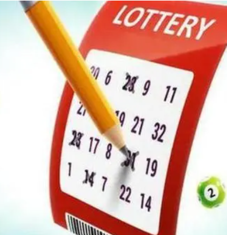

# Lottery Project  &nbsp; 

> Welcome to the Lottery project! 
This Solidity-based smart contract allows users to participate in a lottery and have a chance to win the jackpot. This README file provides an overview of the project, including its features, deployment instructions, and important considerations.

## Features

- Participation: Users can participate in the lottery by sending a specified amount of ether (the ticket price) to the contract.
- Random Selection: Once the lottery deadline is reached, a random participant is selected as the winner using a secure random number generation algorithm.
- Prize Distribution: The winner receives the entire jackpot, which is the sum of all the ticket prices collected during the lottery.
- Transparency: The contract is fully transparent, as all transactions and lottery details are recorded on the Ethereum blockchain.
- Security: The smart contract has been developed with security best practices in mind to prevent any potential vulnerabilities.

## Deployment

To deploy the Lottery project, follow these steps:
- Install Truffle and Ganache, if you haven't already.
- Clone the project repository:  git clone <repository_url> 
- Navigate to the project directory: cd lottery-project
- Install project dependencies: npm install
- Compile the smart contract: truffle compile
- Deploy the contract to a local development network (Ganache): truffle migrate --network development
- Interact with the deployed contract using Truffle console or your preferred Ethereum development environment.

## Usage/Examples

To participate in the lottery, users should follow these steps:
- Connect to a compatible Ethereum wallet (such as MetaMask) and ensure it is connected to the Ethereum network where the contract is deployed.
- Access the Lottery project's interface or dApp.
- Specify the amount of ether to send as the ticket price.
- Submit the transaction to the contract, including the ticket price.
- Wait until the lottery deadline is reached.
- If the user is selected as the winner, the contract will transfer the jackpot to their wallet automatically.
  
## Screenshot

## Considerations

- Ensure that you are using a compatible version of Solidity to compile the smart contract.
- When deploying to a public Ethereum network, consider the gas costs associated with deploying and interacting with the contract.
- Carefully review the code and security considerations before deploying the contract to a production environment.
- Consider adding additional features such as multiple winners, ticket limits, or ticket pools to enhance the project's functionality.
## License

This project is licensed under the [MIT](https://choosealicense.com/licenses/mit/) License. Feel free to modify and use it according to your needs.

## Contributions

Contributions to this project are welcome. If you find any issues or have suggestions for improvements, please open an issue or submit a pull request on the project repository.
## Acknowledgements

We would like to thank the Solidity development community and the contributors of open-source projects that were used in this project.

Happy lottery playing and best of luck to all participants!
